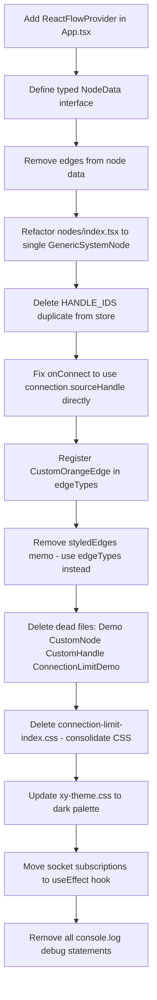

# Canvas Components Audit & Refactoring Plan

> Generated: 2026-07-26  
> Scope: `apps/web/src/components/canvas/` and related files

---

## 1. File-by-File Audit

### 1.1 `DesignCanvas.tsx`

**What it does:**  
Main canvas component. Renders `<ReactFlow>` with custom node types, wires up store callbacks (`onNodesChange`, `onEdgesChange`, `onConnect`), and handles node/pane click for selection. Converts `ComponentSpec[]` from the store into React Flow `Node[]` via `useMemo`, and styles edges inline via another `useMemo`.

**Anti-patterns / Issues:**

| # | Issue | Severity |
|---|-------|----------|
| 1 | **No `ReactFlowProvider` wrapper** — `DesignCanvas` uses `<ReactFlow>` directly but is rendered inside `App.tsx` without a provider. `useReactFlow()` would throw if called in any child node. | High |
| 2 | **`edges` passed through node `data`** — Every node receives the full `edges` array via `data.edges` so nodes can compute their own connection counts. This causes every node to re-render whenever any edge changes — an O(n²) re-render pattern. | High |
| 3 | **Inline edge styling instead of a custom edge type** — `styledEdges` applies `style`, `animated`, and `type: 'default'` inside a `useMemo` transform. `CustomOrangeEdge` exists but is never registered in `edgeTypes`. | Medium |
| 4 | **`sourcePosition` / `targetPosition` on node objects** — Setting `sourcePosition: Position.Right` and `targetPosition: Position.Left` on the node data level overrides custom handle positions. The nodes in `nodes/index.tsx` already position handles explicitly; these props conflict. | Medium |
| 5 | **`width` / `height` hardcoded on node data** — React Flow v12 derives dimensions from the DOM. Hardcoding `width: 120, height: 80` on node objects is a v10-era pattern that can conflict with actual rendered size. | Low |
| 6 | **Debug `console.log` statements left in render path** — Two `console.log` calls fire on every render. | Low |
| 7 | **Debug overlay `<div>`** — Inline debug node/edge count overlay should be removed or gated behind a dev flag. | Low |
| 8 | **Missing `xy-theme.css` import** — `xy-theme.css` is imported in `connection-limit-index.css` but not directly in `DesignCanvas.tsx` (it only imports `connection-limit-index.css` transitively). This is fragile. | Low |

**Recommended changes:**

- Wrap `<ReactFlow>` in `<ReactFlowProvider>` either here or in `App.tsx` (prefer `App.tsx` so `useReactFlow()` is available app-wide).
- Remove `edges` from node `data`. Use the React Flow `isConnectable` callback pattern with `useStore` from `@xyflow/react` inside each node, or pass per-node connection count via a selector.
- Register `CustomOrangeEdge` in an `edgeTypes` constant defined outside the component, and remove the inline styling transform.
- Remove `sourcePosition` / `targetPosition` from node object construction.
- Remove `width` / `height` from node objects unless you explicitly need SSR-safe initial sizing.
- Delete `console.log` calls and the debug overlay `<div>`.

---

### 1.2 `nodes/index.tsx`

**What it does:**  
Defines 11 typed node components (`ClientNode`, `ApiGatewayNode`, etc.) plus a shared `NodeBase` presentational component. Each node accepts `NodeProps`, renders two `Handle` components (source/target), and computes `isConnectable` by counting existing connections from `data.edges`.

**Anti-patterns / Issues:**

| # | Issue | Severity |
|---|-------|----------|
| 1 | **`data` cast with `(data as any)`** — Every node casts `data` to `any` to read `label`, `config`, and `edges`. The correct pattern is to define a typed `NodeData` interface and use `NodeProps<NodeData>`. | High |
| 2 | **`edges` in node `data` for connection limiting** — See §1.1 #2. The whole `edges` array is passed through `data`, causing cascading re-renders. Prefer `useStore` selector or `isValidConnection` on `<ReactFlow>`. | High |
| 3 | **`getConnectionCount` duplicates what React Flow already tracks** — React Flow internally tracks connections. The idiomatic approach is to use the `isConnectable` prop as a function `(connection) => boolean`, or use `useStore(s => s.edges)` inside the node. | Medium |
| 4 | **Massive code duplication** — All 11 nodes share identical structure (2 Handles + NodeBase). Only `id`, `color`, `emoji`, `label`, and handle IDs differ. Should be a single `createNodeComponent(config)` factory or a single `GenericNode` with a config lookup. | Medium |
| 5 | **Handle IDs defined in three places** — Handle ID strings appear in `nodes/index.tsx`, `handleIdMap.ts`, and `useDesignStore.ts` (`HANDLE_IDS`). Single source of truth is needed. | Medium |
| 6 | **`selected` prop typed as `boolean` but received as `boolean | undefined`** — `!!selected` cast is used everywhere; the type should simply be `boolean` per `NodeProps`. | Low |

**Recommended changes:**

- Define a `NodeData` interface: `{ label: string; config: ComponentConfig }` — remove `edges` from node data entirely.
- Create a `NODE_CONFIGS` lookup map `{ [kind]: { emoji, color, handleIn, handleOut, maxConnections } }` keyed by node kind.
- Implement a single `GenericSystemNode` component that reads its config from the map using `props.type`.
- Use `useStore` from `@xyflow/react` inside the node to count connections without prop drilling.
- Delete the duplicated `HANDLE_IDS` object from `useDesignStore.ts` and import from `handleIdMap.ts`.

---

### 1.3 `handleIdMap.ts`

**What it does:**  
Exports a `handleIdMap` record mapping node kind strings to `{ in, out }` handle ID pairs, plus a `getHandleIds` helper.

**Anti-patterns / Issues:**

| # | Issue | Severity |
|---|-------|----------|
| 1 | **Duplicated in `useDesignStore.ts`** — The store contains an identical `HANDLE_IDS` constant (lines 11–23) and imports `getHandleIds` from this file but never calls it (the local constant is used instead). | High |
| 2 | **`getHandleIds` is imported but unused in store** — The import exists at line 6 of `useDesignStore.ts` but only `HANDLE_IDS` (local copy) is used. | Medium |

**Recommended changes:**

- Delete the `HANDLE_IDS` local constant from `useDesignStore.ts`.
- Use `getHandleIds(kind)` from `handleIdMap.ts` exclusively in `onConnect`.
- Consider co-locating `handleIdMap.ts` with the node configs (e.g., inside `nodes/`).

---

### 1.4 `CustomHandle.tsx`

**What it does:**  
A thin wrapper around React Flow's `Handle` that accepts an extra `connectionCount: number` prop but does nothing with it.

**Anti-patterns / Issues:**

| # | Issue | Severity |
|---|-------|----------|
| 1 | **`connectionCount` prop is accepted but ignored** — The prop is declared in the type but not used in any logic. | High |
| 2 | **Component is unused in the actual app** — Only `CustomNode.tsx` (a demo/unused file) imports this. `nodes/index.tsx` uses `Handle` from `@xyflow/react` directly. | High |

**Recommended changes:**

- Either delete `CustomHandle.tsx` (since it's dead code) or promote it to a useful wrapper that enforces connection limits via `isConnectable`.
- If kept: implement actual connection-count-based `isConnectable` logic using `useStore`.

---

### 1.5 `CustomNode.tsx`

**What it does:**  
A demo/prototype node component that renders one `CustomHandle` with a static label "← Only one edge allowed". Not registered in any `nodeTypes` map.

**Anti-patterns / Issues:**

| # | Issue | Severity |
|---|-------|----------|
| 1 | **Not typed with `NodeProps`** — The component signature is `() => JSX.Element` with no props. Custom nodes must accept `NodeProps` (or a subtype) to receive `id`, `data`, `selected`, etc. | High |
| 2 | **Not registered anywhere** — Never appears in any `nodeTypes` object; entirely dead code in production. | High |
| 3 | **Demo/prototype quality** — Hardcoded label, no `data` reading, no `id`. | Medium |

**Recommended changes:**

- Delete `CustomNode.tsx` — it is superseded by the nodes in `nodes/index.tsx`.

---

### 1.6 `CustomOrangeEdge.tsx`

**What it does:**  
A custom edge component using `BaseEdge` + `getStraightPath` to draw a straight orange line.

**Anti-patterns / Issues:**

| # | Issue | Severity |
|---|-------|----------|
| 1 | **Props typed as `any`** — The component accepts `{ id, sourceX, sourceY, targetX, targetY }: any` instead of `EdgeProps` from `@xyflow/react`. | High |
| 2 | **Not registered in `edgeTypes`** — `DesignCanvas.tsx` never defines `edgeTypes` with this component; instead it applies inline `style` per edge in the `styledEdges` memo. | High |
| 3 | **Uses straight path instead of smoothstep** — The standard React Flow default is `smoothstep`; straight lines look unpolished in dense graphs. Consider `getBezierPath` or `getSmoothStepPath`. | Low |

**Recommended changes:**

- Type props with `EdgeProps` from `@xyflow/react`.
- Register in `DesignCanvas.tsx` as `const edgeTypes = { orange: CustomOrangeEdge }` (outside component).
- Remove inline style transforms from `styledEdges` memo; set `type: 'orange'` on each edge in the store.
- Switch path to `getSmoothStepPath` for better aesthetics.

---

### 1.7 `xy-theme.css`

**What it does:**  
Overrides React Flow CSS custom properties for a light-themed design. Sets node border, shadow, handle, and edge colors.

**Anti-patterns / Issues:**

| # | Issue | Severity |
|---|-------|----------|
| 1 | **Light-theme variables conflict with dark canvas** — The app uses a dark `#0f172a` background, but this CSS sets `--xy-background-color: #f7f9fb` (light) and `--xy-node-background-color-default: #ffffff`. Node backgrounds in `nodes/index.tsx` use inline dark colors, which patches over the CSS conflict but creates fragility. | Medium |
| 2 | **`.react-flow__node-custom` rule references a class that doesn't exist** — Line 71 targets `.react-flow__node-custom` but no nodes use the `custom` type. | Low |
| 3 | **Imported transitively via `connection-limit-index.css`** — Should be imported directly in `DesignCanvas.tsx`. | Low |

**Recommended changes:**

- Rewrite variables to match the actual dark theme (`--xy-background-color: #0f172a`, etc.).
- Remove the orphaned `.react-flow__node-custom` rule.
- Import directly in `DesignCanvas.tsx` instead of via `connection-limit-index.css`.

---

### 1.8 `connection-limit-index.css`

**What it does:**  
A CSS entry-point file that re-imports `@xyflow/react/dist/style.css` and `xy-theme.css`, plus resets `html/body/root` styles.

**Anti-patterns / Issues:**

| # | Issue | Severity |
|---|-------|----------|
| 1 | **Misnamed — sounds like an entry point for a demo** — Named after the "connection-limit" demo rather than the app. | Medium |
| 2 | **`@xyflow/react/dist/style.css` is already imported in `DesignCanvas.tsx`** — Results in duplicate style injection. | Medium |
| 3 | **`html/body/#root` resets belong in `index.css`** — These global resets are already partially covered by `apps/web/src/index.css`; the file duplicates global reset logic. | Low |

**Recommended changes:**

- Delete `connection-limit-index.css`.
- Move `@import url('./xy-theme.css')` directly into `DesignCanvas.tsx` (as a regular CSS import).
- Consolidate global resets into `apps/web/src/index.css`.

---

### 1.9 `App.tsx`

**What it does:**  
Root application component. Renders the full layout: header, sidebar (`ComponentPalette`), canvas (`DesignCanvas`), config panel, metrics panel, and score overlay. Also handles socket room join, auto-save, restore from localStorage, problem loading, and scoring.

**Anti-patterns / Issues:**

| # | Issue | Severity |
|---|-------|----------|
| 1 | **No `ReactFlowProvider`** — `DesignCanvas` uses `<ReactFlow>` without a provider ancestor. Any component that calls `useReactFlow()` (e.g., for `fitView`, `getNodes`, or `project`) will fail. | High |
| 2 | **All layout done with inline styles** — No CSS classes/modules. Hard to maintain and test. | Low |
| 3 | **`HasRestoredRef` / `hasJoinedRef` pattern** — Necessary workarounds for React 18 StrictMode double-invoke; acceptable but should be documented. | Low |

**Recommended changes:**

- Wrap `<DesignCanvas />` (or the entire `<main>` block) with `<ReactFlowProvider>`.
- Extract the problems dropdown into its own `<ProblemsDropdown>` component.
- Extract the header into a `<AppHeader>` component.

---

### 1.10 `useDesignStore.ts`

**What it does:**  
Zustand store holding `components: ComponentSpec[]` and `edges: EdgeSpec[]`. Implements `onNodesChange`, `onEdgesChange`, and `onConnect` using React Flow helpers (`applyNodeChanges`, `applyEdgeChanges`, `addEdge`). Also subscribes to socket events for real-time collaboration.

**Anti-patterns / Issues:**

| # | Issue | Severity |
|---|-------|----------|
| 1 | **Duplicate `HANDLE_IDS` constant** — Exact copy of `handleIdMap.ts` exists here (lines 11–23). `getHandleIds` is imported but unused. | High |
| 2 | **`applyNodeChanges` workaround comment** — Lines 118–130 describe a workaround where `applyNodeChanges` strips custom fields (like `kind`). This is because `ComponentSpec` is being used as a React Flow `Node`, but it doesn't extend the `Node` type properly. The fix is to separate the two: keep `ComponentSpec[]` as source of truth and derive `Node[]` in the canvas component (already done in `DesignCanvas.tsx`), but then apply position changes back via a position-only update. The current workaround is functional but brittle. | Medium |
| 3 | **Socket subscriptions set up inside `create()` body** — `socket.on(...)` calls at lines 54 and 78 are registered once when the module is first imported. This is actually fine for singletons but won't clean up on HMR. Should use a separate `initSocketListeners()` function called from a `useEffect` in `App.tsx`. | Medium |
| 4 | **`onConnect` over-engineers handle resolution** — The store manually looks up source/target node kinds to assign `sourceHandle`/`targetHandle`. React Flow already passes `sourceHandle`/`targetHandle` in the `Connection` object when the user drags from a specific handle. This override makes connections non-interactive (always forces the "out"→"in" pair regardless of which handle was dragged). | Medium |
| 5 | **Excessive `console.log` in production code** — ~8 log statements in `onConnect` alone. | Low |

**Recommended changes:**

- Remove local `HANDLE_IDS` and use `getHandleIds` from `handleIdMap.ts`.
- Use `connection.sourceHandle` / `connection.targetHandle` directly in `onConnect` (React Flow provides them when using explicit `Handle` IDs).
- Move socket subscriptions to a `useEffect` in `App.tsx` or a dedicated `useSocketSync` hook.
- Remove debug `console.log` statements.

---

## 2. Files to Delete

| File | Reason |
|------|--------|
| [`Demo.tsx`](apps/web/src/components/canvas/Demo.tsx) | Prototype/demo — not imported by `App.tsx` or any production component |
| [`ReusableDemo.tsx`](apps/web/src/components/canvas/ReusableDemo.tsx) | Prototype/demo — same as above |
| [`ConnectionLimitDemo.tsx`](apps/web/src/components/canvas/ConnectionLimitDemo.tsx) | Demo for connection-limit proof-of-concept — superseded by production node logic |
| [`CustomNode.tsx`](apps/web/src/components/canvas/CustomNode.tsx) | Dead code — not in `nodeTypes`, not imported in production paths |
| [`CustomHandle.tsx`](apps/web/src/components/canvas/CustomHandle.tsx) | Dead code — only used by `CustomNode.tsx` (also dead); `connectionCount` prop is unused |
| [`connection-limit-index.css`](apps/web/src/components/canvas/connection-limit-index.css) | Misnamed CSS entry-point; causes duplicate style imports; global resets belong in `index.css` |

---

## 3. CSS Consolidation Recommendations

```
Current state:
  apps/web/src/index.css                  ← app-wide resets (partial)
  apps/web/src/App.css                    ← likely unused or minimal
  canvas/xy-theme.css                     ← React Flow CSS variable overrides
  canvas/connection-limit-index.css       ← duplicates imports + html/body resets

Target state:
  apps/web/src/index.css                  ← ALL global resets (html, body, #root)
  canvas/xy-theme.css                     ← ONLY React Flow variable overrides (dark theme)
  DesignCanvas.tsx                        ← imports @xyflow/react/dist/style.css + xy-theme.css directly
```

**Steps:**
1. Delete `connection-limit-index.css`.
2. In `DesignCanvas.tsx`, replace `import './connection-limit-index.css'` with `import './xy-theme.css'` (the `@xyflow/react/dist/style.css` import is already present).
3. Update `xy-theme.css` variables to match the dark theme palette (see §1.7).
4. Verify `apps/web/src/index.css` contains the `html/body/#root` resets currently in `connection-limit-index.css`.

---

## 4. Prioritized Refactoring Checklist



### Priority 1 — Correctness / Breaking Issues
- [ ] Add `<ReactFlowProvider>` in `App.tsx` wrapping `<DesignCanvas>`
- [ ] Fix `onConnect` in store to pass through `connection.sourceHandle`/`targetHandle` rather than overriding them
- [ ] Remove `edges` from node `data` (eliminates O(n²) re-renders)

### Priority 2 — Code Quality / Maintainability
- [ ] Define `NodeData` typed interface; replace all `(data as any)` casts
- [ ] Consolidate 11 near-identical node components into a single `GenericSystemNode` with a config lookup
- [ ] Delete duplicate `HANDLE_IDS` from `useDesignStore.ts`; use `getHandleIds()` from `handleIdMap.ts`
- [ ] Register `CustomOrangeEdge` in `edgeTypes`; remove inline `styledEdges` transform
- [ ] Type `CustomOrangeEdge` props with `EdgeProps`

### Priority 3 — Cleanup
- [ ] Delete: `Demo.tsx`, `ReusableDemo.tsx`, `ConnectionLimitDemo.tsx`, `CustomNode.tsx`, `CustomHandle.tsx`
- [ ] Delete `connection-limit-index.css`; consolidate CSS imports
- [ ] Update `xy-theme.css` for dark theme
- [ ] Remove `sourcePosition`/`targetPosition` from node object construction in `DesignCanvas.tsx`
- [ ] Remove debug `console.log` and dev overlay `<div>` from `DesignCanvas.tsx`
- [ ] Remove `width`/`height` from node objects
- [ ] Move socket subscriptions out of `create()` into a dedicated hook/`useEffect`